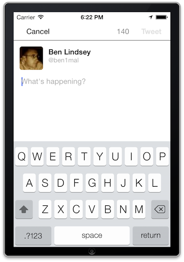

# Twittero

Twittero is a limited clone of the Twitter iPhone App circa October 2013 using storyboards and autolayout. With Twittero you can:

  * View a scrollable timeline view
  * See details on individual tweets
  * Retweet, favorite, and reply to tweets
  * Compose new tweets from the nav bar
  * Logout and login as a different user

I built Twittero as a part of the [iOS CodePath Bootcamp](http://thecodepath.com/iosbootcamp).

## iOS Deployment Target

This project supports iOS 6.0 and above and uses Automatic Reference Counting (ARC).

## Interesting features

  * Proper handling of retweeted statuses in the timeline
  * Updating button state based on asynchronous API calls
  * Expanding height tweet cells
  * Pull to refresh
  * Infinite scroll

## License

  * [MIT](http://opensource.org/licenses/MIT) Copyright (c) 2013 Ben Lindsey

## Building

This projects uses CocoaPods 0.26.2 for its dependency management. For more information, go to: [http://cocoapods.org/](http://cocoapods.org/).
After satisfying those requirements, the build is pretty simple:

  * Run `pod install` from the root directory to install necessary pods
  * Open Twittero.xcworkspace in XCode 5 and run it on a simulator

## Acknowledgements

  * [AFNetworking](https://github.com/AFNetworking/AFNetworking)
  * Twitter OAUTH API

## Contributing

Please fork this repository and contribute back using
[pull requests](https://github.com/blindsey/Twittero/pulls).

Any contributions, large or small, major features, bug fixes, additional
language translations, unit/integration tests are welcomed.
